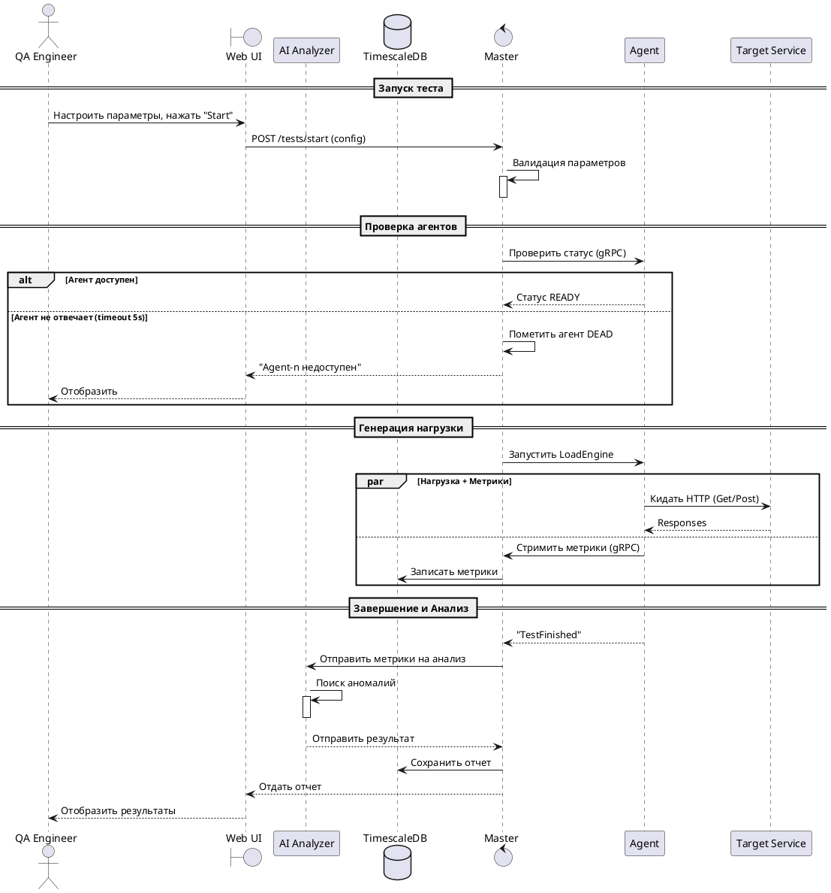
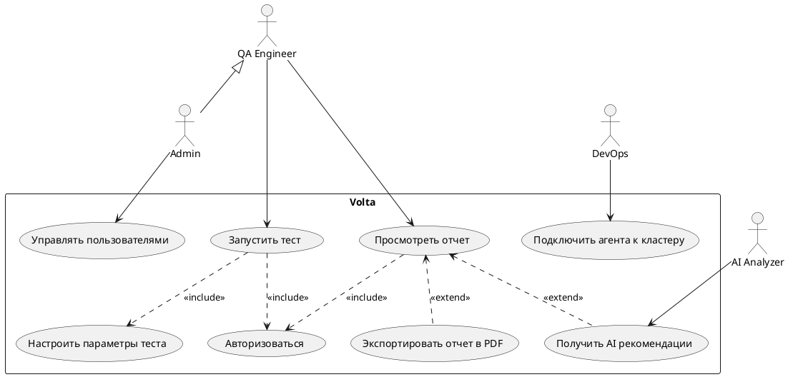

## Проведение нагрузочного тестирования

Sequence диаграмма по бизнес процессу "Проведение нагрузочного тестирования"

## Использование Volta

UseCase диаграмма для бизнес процесса "Использование Volta"

